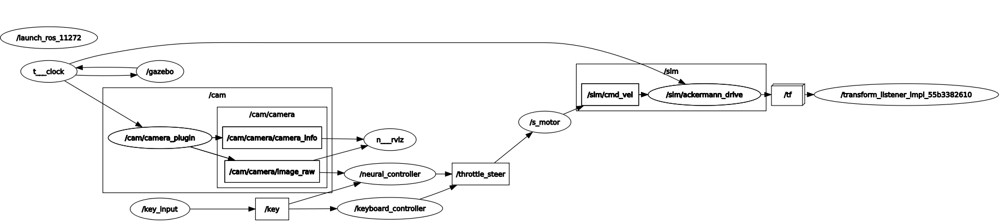
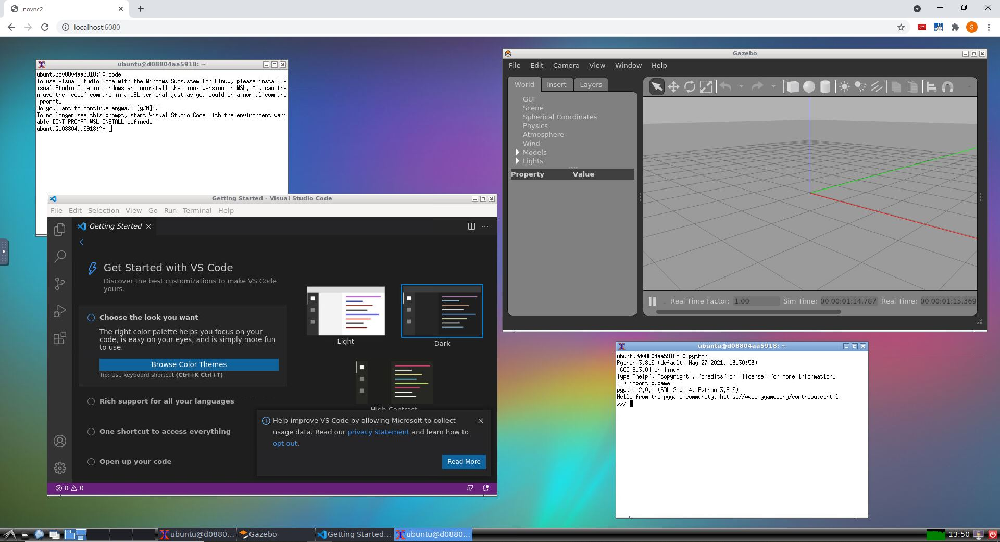

# Racer

自動運転ミニカー

## 環境構築

### Step 1. Jetson NanoにJetPackを入れる

Jetson Nano JetPack 4.5.1をインストールする。

### Step 2. Docker imageのビルド

JetPackには最初からDockerがインストールされているので自らdockerをインストールする必要はない。
このリポジトリのルートに移動し、Docker imageをビルドする。

```sh
cd Racer
bash setup_for_jetson/docker_build.sh
```

このDockerfileは[l4t-ros2-eloquent-pytorch](https://developer.nvidia.com/blog/accelerating-ai-modules-for-ros-and-ros-2-on-jetson/)(バージョン l4t-ros2-eloquent-pytorch:r32.5)
をベースイメージとしており、4GB程度のデータをダウンロードしてくるので初回のビルドには時間がかかる。

※稀にビルド途中にファイル破損することがあるが、その状態で再ビルドしてもキャッシュが悪影響して失敗するため、docker rmiコマンドで破損したイメージを削除して再度トライすること。


### Step 3. Docker imageの起動

ビルドが正常に完了したら、以下のコマンドでdockerコンテナを実行する。

```sh
bash setup_for_jetson/docker_run.sh
```

[参考](https://github.com/dusty-nv/jetson-containers/issues/36)

### Step 4. マウント状態の確認

Step 3.ではbind mountでホスト側のRacerディレクトリをコンテナ側の/appディレクトリと紐付けている。
ソースコード等がコンテナ側から見える状態になっていることを確認する。

```bash
cd /app
ls
```

### Step 5. Docker imageの終了

インタラクティブセッションは以下のコマンドで終了できる。

```
exit
```

## Racerパッケージのビルドと起動

1. リポジトリのルート(README.mdがある場所)に移動

```bash
cd /app
```

2. colconでracerパッケージをビルド

```bash
colcon build --packages-select racer
```

3. setup.bashをソースする（installフォルダはビルド後に作成される）

```bash
. install/setup.bash
```

4. launchファイルを使って必要なノードやgazeboをまとめて起動する

```bash
ros2 launch racer sim_racer.launch.py
```

手順2~4はスクリプトにまとめてある。sim_racerを実行したい場合は`bash sim_run.sh`、racerを実行したい場合は`bash run.sh`で代替できる。

## パッケージ構成

```
src/
  racer/
    launch/ launchファイルの格納場所
      racer.launch.py 実機モードのlaunchファイル
      sim_racer.launch.py シミュレータモードのlaunchファイル
    models/ 車両モデル（SDF、メッシュ）
    racer/ コード本体
    resource/ 略
    test/ 略
    worlds/ 車両の力学モデル+ワールド
    package.xml パッケージ概要、依存ライブラリを記述
    setup.cfg 略
    setup.py ビルド設定を記述
setup_for_jetson/ jetson用のdockerfile、docker buildスクリプト、docker runスクリプト
setup_for_ubuntu/ jetson用のdockerfile、docker buildスクリプト、docker runスクリプト
setup_for_windows/ jetson用のdockerfile、docker buildスクリプト、docker runスクリプト
run.sh 実機モードでのビルドからlaunchまでを一括で実行
sim_run.sh シミュレータモードでのビルドからlaunchまでを一括で実行
```

## ソフト構成



Nodes:
* mode: 制御モード管理
* keyboard: キーボード入力の受付
* key_ctl: キーボード入力をスロットルとステアのコマンドに変換
* joystick: ジョイスティック入力の受付
* joy_ctl: ジョイスティック入力をスロットルとステアのコマンドに変換
* nn_ctl: 画像入力をスロットルとステアのコマンドに変換
* priority: 速度コマンドの優先度調停
* s_motor: スロットルとステアのコマンドをGazeboが受け付ける型に変換
* r_motor: スロットルとステアのコマンドをi2C出力に変換
* gazebo: gazebo simulation

Topics:
* key: std_msgs/String キー入力
* stick: std_msgs/Int8MultiArray ジョイスティック入力
* mode: std_msgs/Int8 制御モード
* ts_key: std_msgs/Int8MultiArray キーボードのスロットル/ステアコマンド(+-100の整数)
* ts_joy: std_msgs/Int8MultiArray ジョイスティックのスロットル/ステアコマンド(+-100の整数)
* ts_nn: std_msgs/Int8MultiArray ニューラルネットワークのスロットル/ステアコマンド(+-100の整数)
* throttle_steer: std_msgs/Int8MultiArray 調停後のスロットル/ステアコマンド(+-100の整数)
* /demo/cmd_demo: geometry_msgs/Twist 速度/角速度コマンド
* /cam/camera/image_raw: sensor_msgs/Image ROS画像


## サンプル画像


## Windows上で実行する方法

setup_for_windowsフォルダに[docker-ros2-desktop-vnc](https://github.com/Tiryoh/docker-ros2-desktop-vnc)をベースにしたDockerfileを置いている。これを使うとWindowsで簡単にROS2実行環境が構築できる。このコンテナを実行するとROS2、Gazebo、VNC、Visual Studio Code (ターミナルから`code`で実行)、python、pip、pythonライブラリ(pygame等)がインストールされた状態でスタートする。

1. Docker for Windowsをインストールする

1. docker_build.batを実行(初回は5GB程度のファイルをダウンロードするため時間がかかる)

1. docker_run.batを実行

1. Webブラウザを起動し、http://127.0.0.1:6080/ (またはlocalhost:6080)にアクセスする

1. VNC画面が現れることを確認する



注意：同じDockerイメージがすでに実行中だと、ポートが競合するためdocker_run.batの実行が失敗する。

## Ubuntu上で実行する方法

setup_for_windowsフォルダに[ros:foxy](https://hub.docker.com/_/ros)をベースにしたDockerfileを置いている。これを使うとUbuntuで簡単にROS2実行環境が構築できる。このコンテナを実行するとROS2、Gazebo、python、pip、pythonライブラリ(pygame等)がインストールされた状態でスタートする。

1. Dockerをインストールする(方法はなんでもよいが[snapコマンド](https://snapcraft.io/install/docker/ubuntu)を使うと楽)

1. docker_build.shを実行(初回は5GB程度のファイルをダウンロードするため時間がかかる)

1. docker_run.shを実行

## 参考: Dockerを使わない場合のセットアップ方法

ros2, colcon, gazeboをインストールしておく。

Jetson Nano JetPack 4.5.1

 - Ubuntu 18.04
 - ROS2 Eloquent 

[How to install ROS2 Elquent](https://docs.ros.org/en/eloquent/Installation/Linux-Install-Debians.html)

[How to install colcon](https://colcon.readthedocs.io/en/released/user/installation.html)

[How to install Gazebo](http://gazebosim.org/tutorials?tut=ros2_installing&cat=connect_ros)

## 参考

ROS2からGazeboを起動する方法

https://automaticaddison.com/how-to-simulate-a-robot-using-gazebo-and-ros-2/

https://zmk5.github.io/general/demo/2019/07/15/ros2-spawning-entity.html


