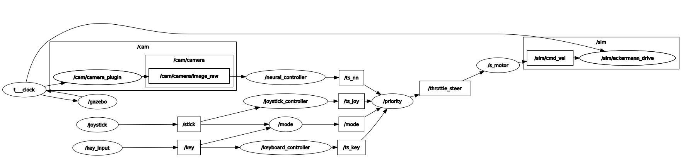

# Racer

自動運転ミニカー

## 環境構築

### Step 1. Jetson NanoにJetPackを入れる

Jetson Nano JetPack 4.5.1をインストールする。

### Step 2. Docker imageのビルド (Jetson用)

JetPackには最初からDockerがインストールされているので自らdockerをインストールする必要はない。
このリポジトリのルートに移動し、Docker imageをビルドする。

```sh
cd Racer
sudo docker build -t racer-image .
```

このDockerfileは[l4t-ros2-eloquent-pytorch](https://developer.nvidia.com/blog/accelerating-ai-modules-for-ros-and-ros-2-on-jetson/)(バージョン l4t-ml:r32.5)
をベースイメージとしており、4GB程度のデータをダウンロードしてくるので初回のビルドには時間がかかる。

※稀にビルド途中にファイル破損することがあるが、その状態で再ビルドしてもキャッシュが悪影響して失敗するため、docker rmiコマンドで破損したイメージを削除して再度トライすること。


### Step 3. Docker imageの実行

ビルドが正常に完了したら、以下のコマンドでインタラクティブセッションを実行する。

```sh
sudo docker run -it --rm --runtime nvidia --network host --mount type=bind,source="$(pwd)",target=/app racer-image
```

### Step 4. ROS2の動作確認

Step 3.のコマンドでは

```bash
cd /app
colcon build --packages-select racer
. install/setup.bash
ros2 launch racer gazebo_manual.launch.py
```

### Step 5. Docker imageの終了

インタラクティブセッションは以下のコマンドで終了できる。

```
exit
```

### 参考: Dockerを使わない場合のセットアップ方法

ros2, colcon, gazeboをインストールしておく。

Jetson Nano JetPack 4.5.1

 - Ubuntu 18.04
 - ROS2 Eloquent 

[How to install ROS2 Elquent](https://docs.ros.org/en/eloquent/Installation/Linux-Install-Debians.html)

[How to install colcon](https://colcon.readthedocs.io/en/released/user/installation.html)

[How to install Gazebo](http://gazebosim.org/tutorials?tut=ros2_installing&cat=connect_ros)


## パッケージ構成

```
src/
  racer/
    launch/ launchファイルの格納場所
    models/ 車両モデル（SDF、メッシュ）
    racer/ コード本体
    resource/ 略
    test/ 略
    worlds/ 車両の力学モデル+ワールド
    package.xml パッケージ概要、依存ライブラリを記述
    setup.cfg 略
    setup.py ビルド設定を記述
```

## ソフト構成



Nodes:
* keyboard: キーボード入力の受付
* key_ctl: キーボード入力をスロットルとステアのコマンドに変換
* joy_ctl: ジョイスティック入力をスロットルとステアのコマンドに変換
* nn_ctl: 画像入力をスロットルとステアのコマンドに変換
* s_motor: スロットルとステアのコマンドをGazeboが受け付ける型に変換
* gzserver: gazebo simulation
* rviz: 可視化

Topics:
* key: std_msgs/String キー入力
* throttle_steer: std_msgs/Int8MultiArray スロットル/ステアコマンド(+-100の整数)
* /demo/cmd_demo: geometry_msgs/Twist 速度/角速度コマンド
* /cam/camera/image_raw: sensor_msgs/Image ROS画像

## ビルドと起動

リポジトリのルート(README.mdがある場所)に移動

```bash
cd Racer
```

colconでracerパッケージをビルド

```bash
colcon build --packages-select racer
```

setup.bashをソースする（installフォルダはビルド後に作成される）

```bash
. install/setup.bash
```

launchファイルを使って必要なノードやgazeboをまとめて起動する

```bash
ros2 launch racer gazebo_manual.launch.py
```


## サンプル画像


## 参考

ROS2からGazeboを起動する方法

https://automaticaddison.com/how-to-simulate-a-robot-using-gazebo-and-ros-2/

https://zmk5.github.io/general/demo/2019/07/15/ros2-spawning-entity.html


